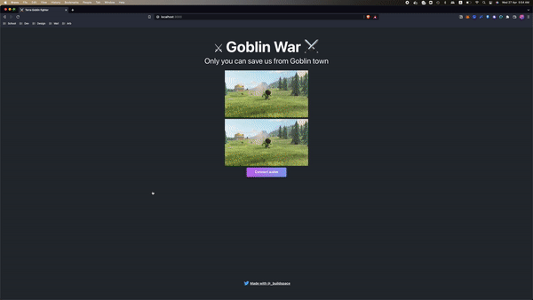

# terra-clicker-game


<p align="center">
  
</p>

### Stuff learnt
- [x] cosmwasm contract architecture
- [x] terra js 

### How to start

Clone `terra-clicker-game`:

```sh
git clone https://github.com/laiweileeee/terra-clicker-game.git
```

Install all dependencies:

```sh
cd terra-clicker-game
yarn install
```

Run your App:

```sh
yarn start
```
